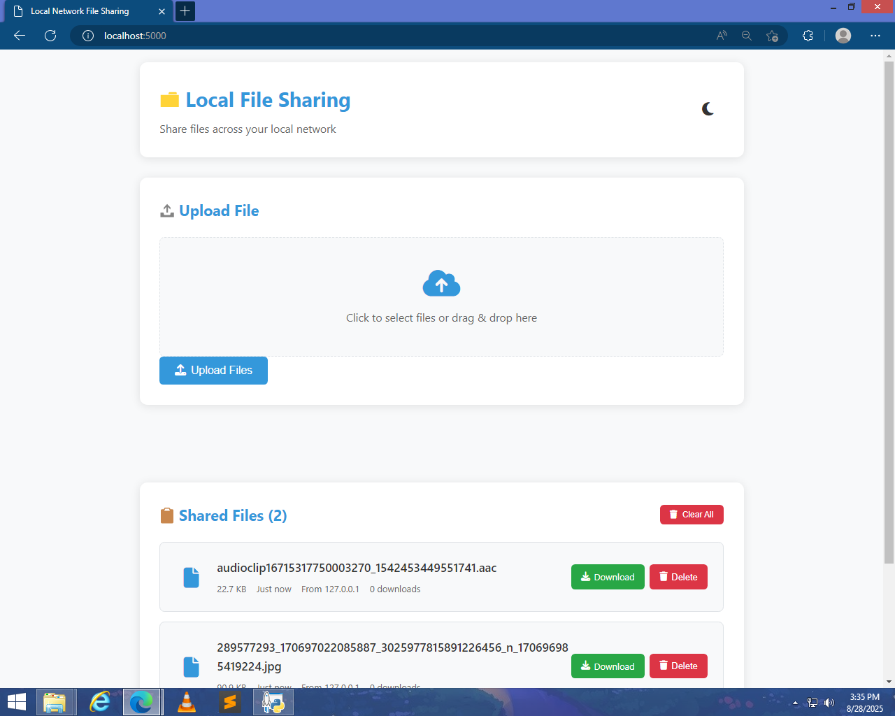
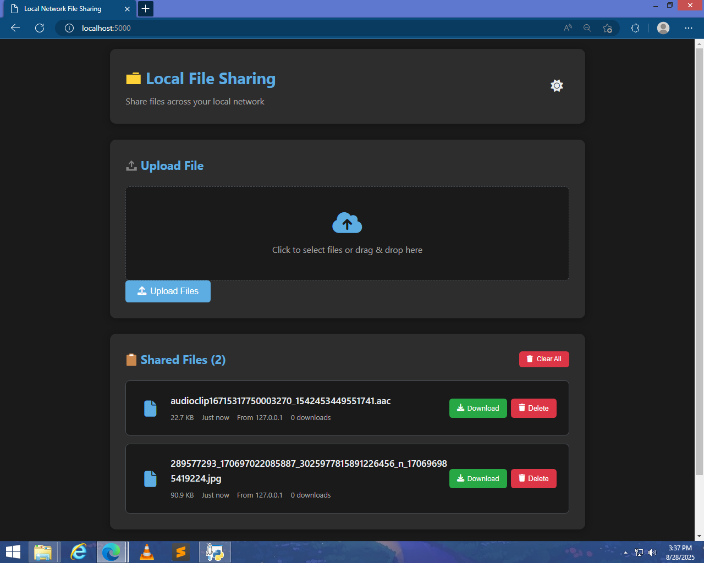

# 📂 LightShare  

**LightShare** is a lightweight **Flask-based file sharing server** that allows users to **upload, download, and manage files** through a simple web interface.  

Designed for:  
- 💻 **Low-end PCs or older hardware**  
- ⚡ Users who want a **fast, easy-to-use local file sharing solution**  
- 🛠️ Quick file management without heavy server software  

## 🚀 Features  
- 📤 Upload files up to 100MB  
- 📥 Download files with original filenames preserved  
- 🗑️ Delete individual files or clear all files  
- 🕒 Shows upload time and relative time (e.g., "2 hours ago")  
- Tracks **download counts** for each file  
- Light and Dark mode UI (see screenshots)  

## 🛠️ Tech Stack  
- **Backend:** Python (Flask)  
- **Frontend:** HTML, CSS, JavaScript  
- **Other:** JSON for metadata storage, Jinja2 templates  

## 📂 Project Structure  

    LightShare/
    │── app.py # Flask app
    │── templates/ # HTML templates
    │── static/ # CSS, JS, icons
    │── shared_files/ # Uploaded files
    │── file_metadata.json # Metadata storage
    │── screenshots/ # Screenshots
    │ ├── LightMode.png
    │ └── DarkMode.png
    │── README.md


## ⚙️ Installation

1.  Clone this repository:

    ``` bash
    git clone https://github.com/Frustrated-Likhon/Light-Share
    cd LightMedia
    ```

2.  Install dependencies:

    ``` bash
    pip install flask werkzeug
    ```

3.  Create a **media_files** folder and add your videos, audio, and
    images:

    ``` bash
    mkdir media_files
    ```

4.  Run the app:

    ``` bash
    python app.py
    ```

5.  Open in your browser:

        http://127.0.0.1:5000

6.  To access from **other devices in the same network**, use your
    **PC's IP address** instead of `127.0.0.1`:

        http://YOUR_PC_IP:5000

    Example: `http://192.168.1.10:5000`

    To change the port, edit the last line of **app.py**:

    ``` python
    if __name__ == '__main__':
        app.run(host='0.0.0.0', port=5000, debug=True)
    ```

    Replace `5000` with your desired port number.

## 🎮 Usage

    1.Upload files via the Upload button

    2.Download files using the Download button

    3.Delete files individually or use Clear All to remove everything

    4.Switch between Light and Dark mode for the UI

## 📷 Screenshots 

### Home Page


### Video Player


## 🤝 Contributing

Pull requests are welcome! For major changes, please open an issue first
to discuss what you'd like to change.


